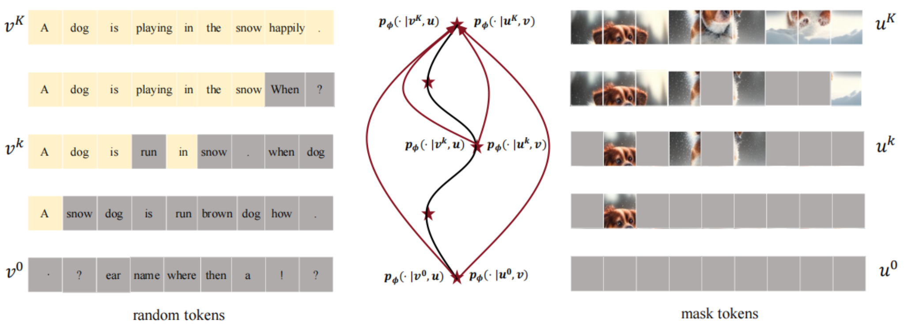
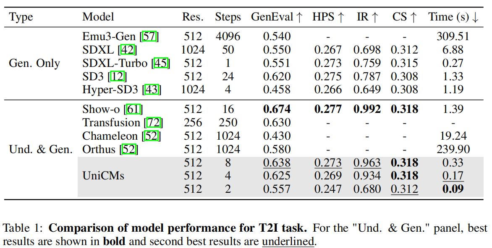
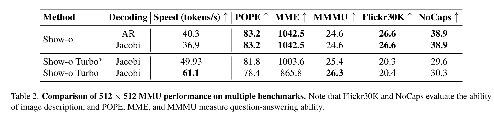
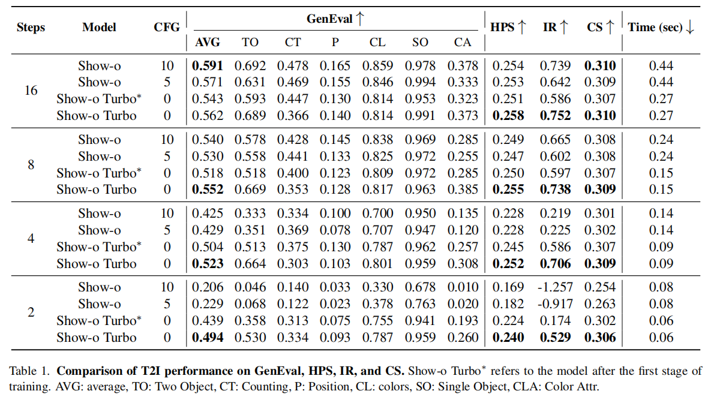
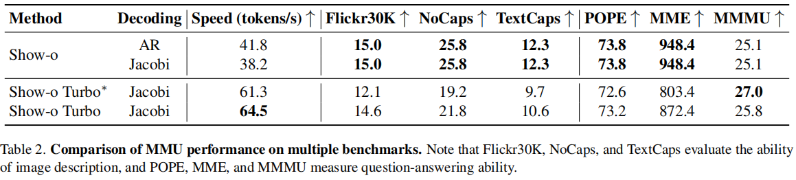
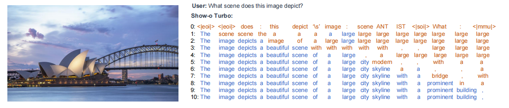
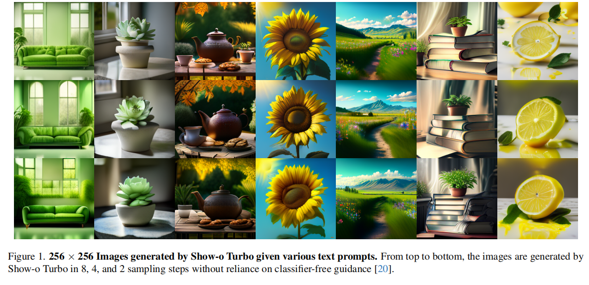

<div align="center">

 <!-- Slightly larger logo -->

### Show-o Turbo: Towards Accelerated Unified Multimodal Understanding and Generation

<!-- Authors and affiliations with improved formatting -->
Chenkai Xu<sup>1*</sup>, Xu Wang<sup>1*</sup>, Zhenyi Liao<sup>1</sup>, Yishun Li<sup>2</sup>, Tianqi Hou<sup>3</sup>, Zhijie Deng<sup>1†</sup><br>
<sup>1</sup>Shanghai Jiao Tong University &nbsp; <sup>2</sup>Huawei &nbsp; <sup>3</sup>Tongji University
<br>
{132435xck,wangxu60,zhijied}@sjtu.edu.cn <!-- Compact email display -->
<br>
<sup>*</sup>Equal contribution. &nbsp; <sup>†</sup>Corresponding author.
<br>

<!-- Badges with more spacing and consistent style -->
[](https://arxiv.org/abs/2502.05415) &nbsp;
[](https://huggingface.co/SJTU-Deng-Lab/Show-o-Turbo-256) &nbsp;
[](https://huggingface.co/SJTU-Deng-Lab/Show-o-Turbo-512)

</div>

<br>

## News

<!-- Use a bulleted list with bold dates for better readability -->

*   **[2024-11-29]** We release a [256-resolution version of the weights](https://huggingface.co/SJTU-Deng-Lab/Show-o-Turbo-256) for Show-o Turbo on Hugging Face.
*   **[2025-2-12]** We release a [512-resolution version of the weights](https://huggingface.co/SJTU-Deng-Lab/Show-o-Turbo-512) for Show-o Turbo on Hugging Face.

<br>

## What's New about Show-o Turbo?

Show-o Turbo builds upon Show-o to address its inefficiency issues in both image and text generation. While Show-o relies on progressive denoising for images and autoregressive decoding for text, Show-o Turbo introduces a unified denoising perspective for both modalities, leading to significantly faster generation speeds.  Show-o Turbo achieves this through several key innovations:

<br>

<p align="center">
  <!-- Slightly smaller image, adjust width as needed -->
</p>

<br>

<!-- Use a bulleted list with more descriptive points -->

*   **Unified Denoising:** Show-o Turbo leverages parallel text decoding techniques (Jacobi decoding) to reframe text generation as a denoising process, mirroring image generation. This creates a unified perspective where both modalities are treated as denoising trajectories.
*   **Consistency Distillation:** Inspired by acceleration techniques in diffusion models, Show-o Turbo employs consistency distillation to significantly shorten these multimodal denoising trajectories. This results in much faster content generation.
*   **Trajectory Segmentation and Curriculum Learning:** To improve training convergence, Show-o Turbo adopts a staged training approach.  This involves progressively decreasing trajectory segments and incorporating curriculum learning.
*   **Top-k Sampling:** To enhance the quality of generated samples, particularly when using fewer sampling steps, Show-o Turbo incorporates top-k sampling during the inference phase.

<br>

## Results

Show-o Turbo demonstrates substantial speed improvements in both text-to-image and image-to-text generation, all while maintaining performance levels comparable to Show-o.  **Importantly, we are releasing models for both 256 and 512 resolutions.**

<!-- Use headings for different result sections -->

### 512-Resolution Model

*   **Text-to-Image Generation:**  The 512-resolution Show-o Turbo surpasses Show-o's 8-step sampling performance with just 4 steps, and outperforms Show-o's 4-step sampling with only 2 steps.

    <p align="center">
     <!-- Adjust width as needed -->
    </p>

*   **Multimodal Understanding:**  The 512-resolution model achieves approximately 1.5x faster inference with minimal performance degradation.

    <p align="center">
    
    </p>

### 256-Resolution Model

*   **Text-to-Image Generation:** The 256-resolution Show-o Turbo achieves performance close to Show-o's 8-step sampling at 4 steps, and surpasses Show-o's 4-step sampling at 2-step sampling.

    <p align="center">
    
    </p>

*   **Multimodal Understanding:** The 256-resolution model is about 1.5 times faster without much performance loss.

    <p align="center">
    
    </p>

<br>

## Getting Started

First, create and activate the Conda environment:

```bash
conda create -n Show-o-Turbo python=3.8
conda activate Show-o-Turbo  # Activate the environment
cd Show-o-Turbo
pip3 install -r requirements.txt
```

### Inference

<!-- Use subheadings and code blocks for clarity -->

#### Multimodal Understanding

```bash
# For 512-resolution model
sh inference_mmu_512.sh

# For 256-resolution model
sh inference_mmu_256.sh
```

<p align="center">
 <!-- Adjust image size as needed -->
</p>

#### Text-to-Image Generation

```bash
# For 512-resolution model
sh inference_t2i_512.sh

# For 256-resolution model
sh inference_t2i_256.sh
```

<p align="center">
  <!-- Example output for 512-res -->
</p>

<p align="center">
  <!-- Example output for 256-res -->
</p>

<br>

## Training pipeline

```bash
sh train_script/train512.sh
```

<br>


## TODO

<!-- Use a checklist for better visual representation -->

*   [x] Release inference and training code.
*   [x] Release model weights.
*   [x] Conduct further experiments with larger models and datasets.

<br>

## Contributing

We warmly welcome contributions to Show-o Turbo!  If you have suggestions for new features or improvements, please open an issue or submit a pull request. Your contributions are highly appreciated!

<br>

## Citation

```bibtex
@misc{xu2025showoturboacceleratedunified,
      title={Show-o Turbo: Towards Accelerated Unified Multimodal Understanding and Generation}, 
      author={Chenkai Xu and Xu Wang and Zhenyi Liao and Yishun Li and Tianqi Hou and Zhijie Deng},
      year={2025},
      eprint={2502.05415},
      archivePrefix={arXiv},
      primaryClass={cs.CV},
      url={https://arxiv.org/abs/2502.05415}, 
}
```

<br>

## Acknowledgments

We extend our sincere gratitude to the authors of Show-o and the developers of the essential libraries and frameworks that underpin Show-o Turbo.  This includes, but is not limited to: open-muse, Phi-1.5, maskgit, taming-transformers, transformers, accelerate, and diffusers.  We deeply appreciate the invaluable contributions of all the authors.
