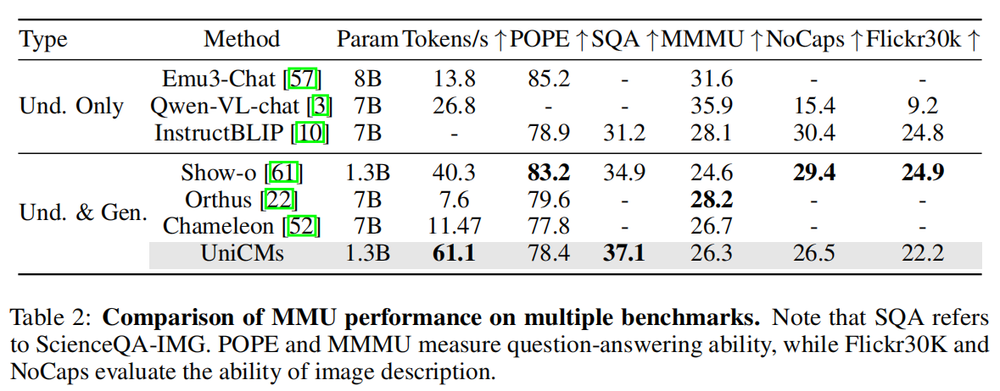
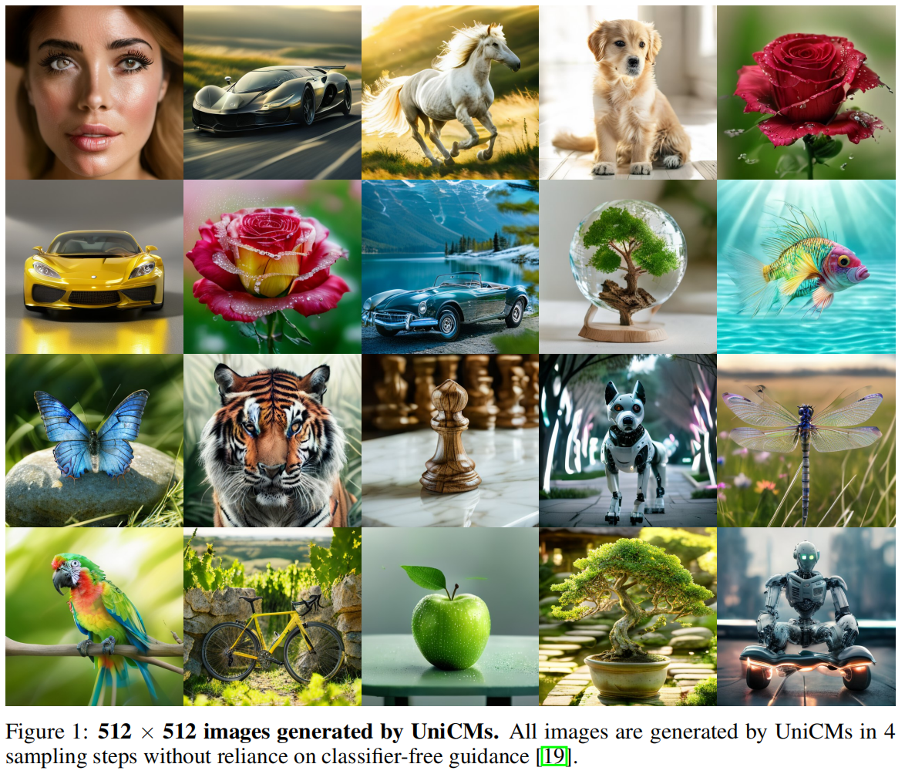

<div align="center">

 <!-- Slightly larger logo -->

### UniCMs: A Unified Consistency Model For Efficient Multimodal Generation and Understanding

<!-- Authors and affiliations with improved formatting -->
Chenkai Xu<sup>1*</sup>, Xu Wang<sup>1*</sup>, Zhenyi Liao<sup>1</sup>, Yishun Li<sup>2</sup>, Tianqi Hou<sup>3</sup>, Zhijie Deng<sup>1†</sup><br>
<sup>1</sup>Shanghai Jiao Tong University &nbsp; <sup>2</sup>Huawei &nbsp; <sup>3</sup>Tongji University
<br>
{132435xck,wangxu60,zhijied}@sjtu.edu.cn <!-- Compact email display -->
<br>
<sup>*</sup>Equal contribution. &nbsp; <sup>†</sup>Corresponding author.
<br>

<!-- Badges with more spacing and consistent style -->
[](https://arxiv.org/abs/2502.05415) &nbsp;
[](https://huggingface.co/SJTU-Deng-Lab/UniCMs-256) &nbsp;
[](https://huggingface.co/SJTU-Deng-Lab/UniCMs-512)

</div>

<br>

## News

<!-- Use a bulleted list with bold dates for better readability -->

*   **[2024-11-29]** We release a [256-resolution version of the weights](https://huggingface.co/SJTU-Deng-Lab/UniCMs-256) for UniCMs on Hugging Face.
*   **[2025-2-12]** We release a [512-resolution version of the weights](https://huggingface.co/SJTU-Deng-Lab/UniCMs-512) for UniCMs on Hugging Face.

<br>

## What's New about UniCMs?

UniCMs is a unified consistency model that solves the problem of low generation efficiency in unified models across various multimodal tasks. UniCMs significantly accelerates generation speed by using discrete diffusion for image modeling and introducing parallel decoding into autoregressive text modeling, thereby establishing a unified denoising perspective for both modalities. UniCMs achieves this goal through the following key innovations:

<br>

<p align="center">
  <!-- Slightly smaller image, adjust width as needed -->
</p>

<br>

<!-- Use a bulleted list with more descriptive points -->

*   **Unified Denoising:** UniCMs leverages parallel text decoding techniques (Jacobi decoding) to reframe text generation as a denoising process, mirroring image generation. This creates a unified perspective where both modalities are treated as denoising trajectories.
*   **Consistency Distillation:** Inspired by acceleration techniques in diffusion models, UniCMs employs consistency distillation to significantly shorten these multimodal denoising trajectories. This results in much faster content generation.
*   **Trajectory Segmentation and Curriculum Learning:** To improve training convergence, UniCMs adopts a staged training approach.  This involves progressively decreasing trajectory segments and incorporating curriculum learning.
*   **Top-k Sampling:** To enhance the quality of generated samples, particularly when using fewer sampling steps, UniCMs incorporates top-k sampling during the inference phase.

<br>

## Results

UniCMs demonstrates substantial speed improvements in both text-to-image and image-to-text generation.  **Importantly, we are releasing models for both 256 and 512 resolutions.**

<!-- Use headings for different result sections -->

### 512-Resolution Model

*   **Text-to-Image Generation:**  The 512-resolution T2I of UniCMs.

    <p align="center">
     <!-- Adjust width as needed -->
    </p>

*   **Multimodal Understanding:**  The 512-resolution MMU of UniCMs.

    <p align="center">
    
    </p>


<br>

## Getting Started

First, create and activate the Conda environment:

```bash
conda create -n UniCMs python=3.8
conda activate UniCMs  # Activate the environment
cd UniCMs
pip3 install -r requirements.txt
```

### Inference

<!-- Use subheadings and code blocks for clarity -->

#### Multimodal Understanding

```bash
# For 512-resolution model
sh inference_mmu_512.sh

# For 256-resolution model
sh inference_mmu_256.sh
```

<p align="center">
 <!-- Adjust image size as needed -->
</p>

#### Text-to-Image Generation

```bash
# For 512-resolution model
sh inference_t2i_512.sh

# For 256-resolution model
sh inference_t2i_256.sh
```

<p align="center">
  <!-- Example output for 512-res -->
</p>


<br>

## Training pipeline

```bash
sh train_script/train512.sh
```

<br>


## TODO

<!-- Use a checklist for better visual representation -->

*   [x] Release inference and training code.
*   [x] Release model weights.
*   [x] Conduct further experiments with larger models and datasets.

<br>

## Contributing

We warmly welcome contributions to UniCMs!  If you have suggestions for new features or improvements, please open an issue or submit a pull request. Your contributions are highly appreciated!

<br>

## Citation

```bibtex
@misc{xu2025unicmsunifiedconsistencymodel,
      title={UniCMs: A Unified Consistency Model For Efficient Multimodal Generation and Understanding}, 
      author={Chenkai Xu and Xu Wang and Zhenyi Liao and Yishun Li and Tianqi Hou and Zhijie Deng},
      year={2025},
      eprint={2502.05415},
      archivePrefix={arXiv},
      primaryClass={cs.CV},
      url={https://arxiv.org/abs/2502.05415}, 
}
```

<br>

## Acknowledgments

We extend our sincere gratitude to the authors of Show-o and the developers of the essential libraries and frameworks that underpin UniCMs.  This includes, but is not limited to: open-muse, Phi-1.5, maskgit, taming-transformers, transformers, accelerate, and diffusers.  We deeply appreciate the invaluable contributions of all the authors.
